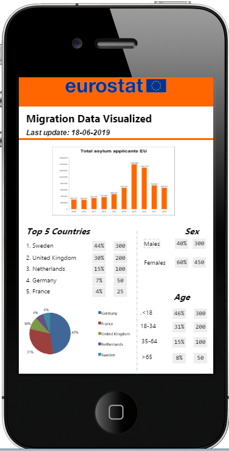
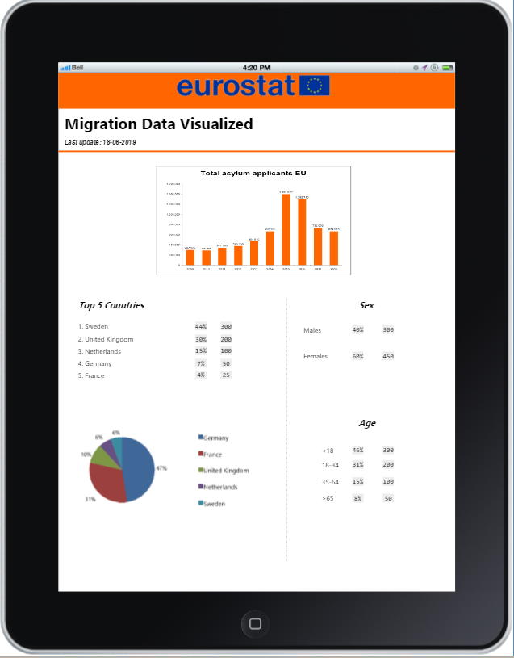
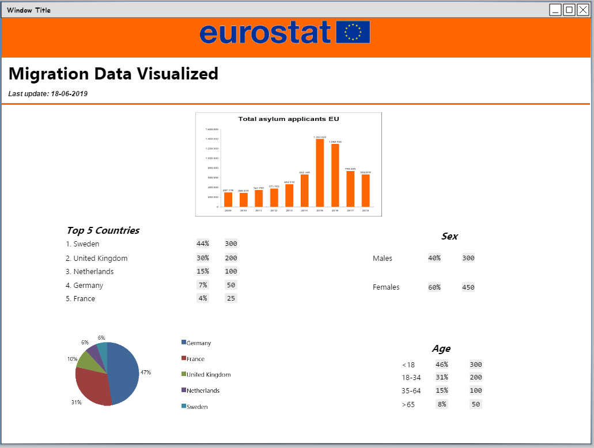

# EUROSTAT - Migration Data Visualised

## Milestone 2 Project: Interactive Frontend Development.
###### Disclaimer: *this dashboard is made for educational use only.*

## About this dashboard
Eurostat is the statistical office of the European Union situated in Luxembourg. Its mission is to provide high quality statistics for Europe.
Providing the European Union with statistics at European level that enable comparisons between countries and regions their key task. 
On the other hand, the public and media need statistics for an accurate picture of contemporary society and to evaluate the performance of politicians and others.

This data dashboard represents data about Asylum applicants in the 28 member states, by age and sex, based on Annual aggregated data (rounded) and was last updated on the 18th of June 2019.

Migration is not the only interesting statistical data Eurostat has. Therefore, the link to the Eurostat database is given top left, which opens to a new page.

## UX
An important question in the migration chain is not only how much applicants will come their way, but the composition of the migrationstream is also very important.
For instance, when their are mostly males it is very likely that they travelled ahead and that family reunification will most likely follow. When the group of minors get bigger this will have consequences on the type of accomodations needed and for instance the educational necessities. 
As mentioned earlier it is also important to identify the top-5 countries, because in the highest influx there is the most diversity or are certain trends better to observe and often more accurate. Furthermore, it identifies which part of Europe is most favored by the asylum seekers as an asylum seeker can only to one EU country due to the EU Dublin Regulation.

#### Audience
My main goal was to give this information without showering the users with all kinds of tables and graphs. My goal audience are policy officers that have to be able to go to parliament with certain data, but are often not as skilled in reading complicated data and graphs.

#### Mockups & other design decisions

##### Mockups

The mockups were created with Pencil Project and are in the <a href="https://github.com/rory81/eurostat-migration-db/tree/master/assets/images" target="_blank">/assets/images</a> folder

    

##### Deviations from the Mockups

For the mobile and the ipad version the country, sex and age elements are stacked rather than next to each other for readibility and user friendliness.

##### Other Design decisions

The color blue used in the reset button and for the link to Eurostat is the blue that Eurostat uses, namely (#003399).

The color orange makes it more lively and is good and warm counter color to the grey, which is the color when a certain year is not selected, or the blue in the Eurostat logo.

The colors for the pie are the automatic generated color palette, which matched nicely with the other colors.

As font type Roboto was choosen as it makes text as well as numbers nicely readible.

## Features

This project has 1 page. A short description of the content of this page is written below.

### Total asylum applicants per year in 28 EU Countries
This graph represents the total number of asylum applicants in the 28 member states from 2013 to 2018 and is the main focus for this dashboard. By clicking one or more years the selected bar will turn orange and the underlining tables and pie will show the composition of the influx of asylum seekers for those selected years.
Years with a grey bar are not a part of the dataset, but if the user wants back to selecting all the available years, the button "Reset filters" can be used.

Because this graph is the main focus of this dashboard it will stay in screen while the other tables will slide underneath it. Furthermore, this way the reset button is always readily available.

### Top-5 Country Table and Pie
The most important countries are the top-5, because in the highest influx there is the most diversity or are certain trends better to observe and often more accurate.

The percentages on the country table represent the percentage on the total influx for the selected years

The pie slices or the country names in the legend of the pie chart can be selected if the user not only wants the influx of a specific period, but wants to zoom further into a specific top-5 country.
Important to note is when years and countries are selected and the user clicks on the reset button the years as well as the countries are reset to the initial values, namely the influx over 2013-2018 and the corresponding top-5 countries.

### Sex Table
The sex table only gives information about Male/Female/Unknown and doesn't reflect any information about gender. It will give the number and percentages based on the selected years and/or countries.

### Age Table
The age gives information about age categories and will give the number and percentages based on the selected years and/or countries.

### Location Dashboard
The dashboard is available on <a href='https://rory81.github.io/eurostat-migration-db/' alt='location dashboard' target="_blank">GitHub</a>.

### More statistical information
Migration is not the only interesting statistical data Eurostat has. Therefore, the link to the Eurostat database is given top left, which opens to a new page, to give the user access to more information when needed

## Technologies Used

In this section, you should mention all of the languages, frameworks, libraries, and any other tools that you have used to construct this project. For each, provide its name, a link to its official site and a short sentence of why it was used.

- [HTML](https://www.w3.org/html/)
    - The project uses HTML as it is World Wide Web’s core markup language
    - Fontawesome was used to get the Roboto font family
- [CSS](https://www.w3.org/Style/CSS/)
    - The project uses CSS to style the HTML
    - Bootstrap (https://getbootstrap.com/) classes are used
- [JQuery](https://jquery.com)
    - The project uses JQuery to simplify DOM manipulation.
    - Bootstrap (https://getbootstrap.com/) plugins are used
- [JavaScript](https://www.javascript.com/)
    - The project uses JavaScript to create the d3 dashboard elements with the crossfiltering.
    - To read the .csv file "migrationData" in the <a href="https://github.com/rory81/eurostat-migration-db/tree/master/assets/data" target="_blank">data folder</a>
    - to do some data cleaning (like making values acceptable to do calculations with, or to rename categories in the data)
    
    For JavaScript the following libraries were used:
    - crossfilter.min.js
    - dc.min.js
    - dc.min.css
    - d3.min.js
    - queue.min.js
- [Microsoft Office Excel](https://products.office.com/nl-nl/excel)
    - Excel was used to test by making pivot tables.

## Testing

### Code Validation

- The HTML validator <a href="https://validator.w3.org/">(W3C Markup Validation Service)</a> gives: "No errors or warnings to show".
- The CSS validator <a href="https://jigsaw.w3.org/css-validator/">(W3C CSS Validation Service)</a> gives: "No Error Found." The validation was only done on the style.css and not on the external css files like dc.min.css.
- The JS validator <a href="https://jshint.com/">(JSHint)</a> gives the following result:
    - arrow function syntax (=>)' is only available in ES6: however the tables are giving the requested result.
    - queue, d3, dc and crossfilter are undefined variables: this is because they are called from external sources.

### Responsiveness other devices
Used the chrome developer tools to test the responsiveness on: Galaxy S5, iPhoneX, iPad and iPad Pro

It is also tested on a lenovo yoga (small screen) and an acer aspire v nitro (bigger screen).

The site has also been tested on the iPad Air 2 (horizontally and vertically)

### Testing data
The numbers in the dashboard were checked with an Excel pivot table based on the same data. The total numbers per year were also displayed as comments in the main.js file in order to test the total numbers after making a big change.

## Deployment

The site was developed using AWS Cloud 9

### Git(Hub) version control
Git is used to track the changes made and with that to have version control. The following steps are needed to track the changes made in the local repository:

**Step 1: $ git add [file]** Snapshots the file in preparation for versioning. For [file] fill in the (path to the) filename to be versioned.

**Step 2: $ git commit -m "[descriptive message]"** Records file snapshots permanently in version history. In the descriptive message a short description of the changes made are stated.

**Step 3: $ git push [file]** Uploads the local commits to GitHub

### Git(Hub) pages

This dashboard is hosted using GitHub pages, on <a href="https://rory81.github.io/eurostat-migration-db/">https://rory81.github.io/eurostat-migration-db/</a>, deployed directly from the `master` branch. 

To deploy to GitHub pages there are multiple <a href="https://help.github.com/en/articles/configuring-a-publishing-source-for-github-pages">options</a>. For this dashboard the following steps were made.

**Step 1:** navigate to the repository for this dashboard (login needed) *https://github.com/rory81/eurostat-migration-db*

**Step 2:** go to the Settings tab (with a gear symbol)

**Step 3:** scroll down to the section ***GitHub Pages***

**Step 4:** as Source select the **master branch**

**Step 5:** the only thing left to do is to hit **Save**

The deployed site will automatically update the new commits from the `master` branch. It is important to remember that for the site to deploy correctly on GitHub pages, the landing page must be named `index.html`.

The underlining steps are needed to clone this GitHub repository to another local repository:

**Step 1:** navigate to the repository for this dashboard (login needed) *https://github.com/rory81/eurostat-migration-db*

**Step 2:** click on the green button saying **Clone or download**

**Step 3:** In the Clone with HTTPs section, copy the clone URL (https://github.com/rory81/eurostat-migration-db.git) for the repository

**Step 4:** Go to the IDE that you are using (like for instance AWS Cloud9) and open the terminal (Git Bash)

**Step 5:** Type `git clone [URL]`. For [URL] fill in the URL that was copied in step 3 and press Enter

## Credits

The data was made available by the database of <a href="https://appsso.eurostat.ec.europa.eu/nui/show.do?dataset=migr_asyappctza&lang=en">Eurostat</a>.  

## Acknowledgments
- One of the results for the milestone 1 project was that I needed more detail in the Deployment part. Therefore I looked at the README from https://jbroks.github.io/GB-Accidents-Dashboard/
- used https://code-institute-room.slack.com/archives/C7HD37Q1F/p1545124218942400 to obtain responsive charts
- used multiple stackoverflow items to make the reset button
- A huge thanks to tutor Niel McEwan. Where many trying to halp me were stuck he really came through with my dataTables.
- Thanks to my mentor Maranatha Ilesanmi for advising me.

